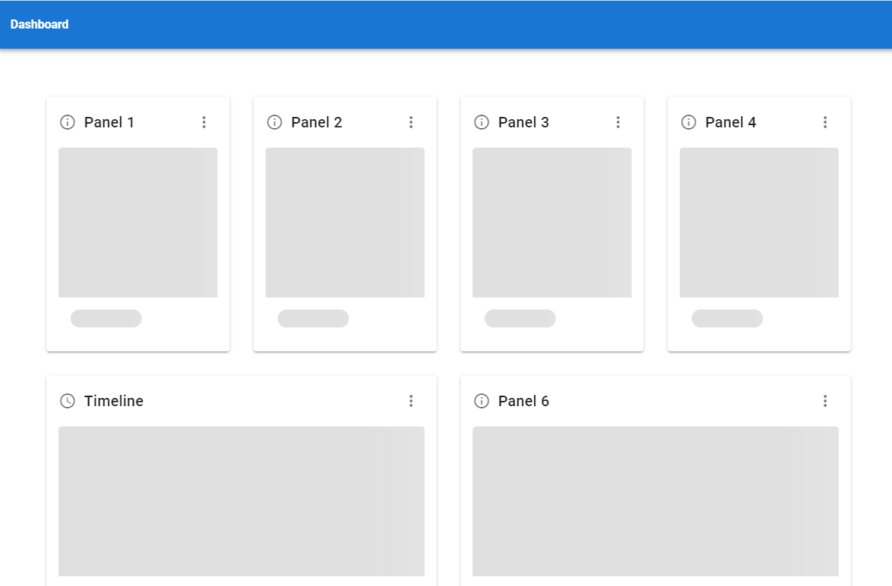

# Dynamic Dashboard Vue

A Vue.js 3.x component case study.  Dynamic Dashboard loads and positions panels based on json data. It also loads a user defined widget into each panel.


## Dynamically Loading the Widget
Internally, [Panel.vue](./src/components/lib/Panel.vue)
 binds its widget property to the 'is' property of Vue's component tag. 
When the panel mounts, it loads the widget using webpack's dynamic import. The panel then sets its widget property to the loaded widget component.
```        
    // binding to the component tag
    <component :style="showSkeletor ? {display: 'none'} : {display: 'block'}" v-bind:is="widget"></component>

    //on mounted, the panel loads the widget and then sets the widget property
    import(`../app/${this.panelConfig.widget.name}.vue`).then((module) => {
      this.widget = Vue.component(
          this.panelConfig.widget.name,
          module
      ).default;

```


## Layout Alg
[Dashboard.Vue](./src/components/lib/Dashboard.vue) loops through the panels collection defined in [dashboard.json](./src/assets/mock-data/dashboard.json)
 and adds each [Panel.Vue](./src/components/lib/Panel.vue) component to its 12 column css grid and then binds the grid properties including row,col and respective spans. 


## Dependency injection
Dashboard.vue uses Vue's dependency injection (new feature Vue.js 3.x) to facilitate scoped communication between the panel and widget components. 

## UX - Dashboard Loading VS Panel Loading  
TBD



